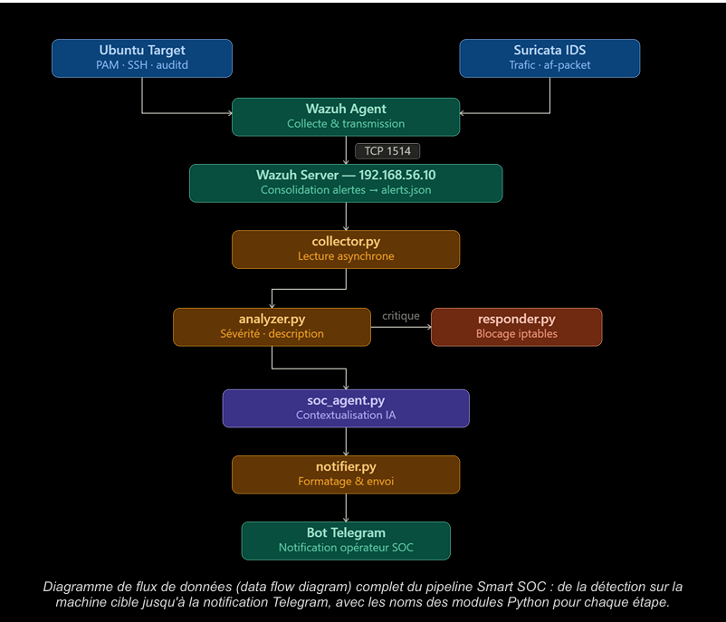

# Network Intrusion Detection System (IDS)

**Développé par : Fayrouz Jbeli**

Un système complet de détection d'intrusion réseau écrit en Python, capable de détecter des attaques basées sur des signatures et des anomalies statistiques.

## 📋 Table des matières
- [Vue d'ensemble](#-vue-densemble)
- [Architecture](#-architecture)
- [Installation](#-installation)
- [Utilisation](#-utilisation)
- [Configuration](#-configuration)
- [Tests](#-tests)
- [Docker](#-docker)
- [Sécurité](#-sécurité)
- [Dépannage](#-dépannage)

## 🎯 Vue d'ensemble

Ce projet implémente un IDS (Intrusion Detection System) avec les fonctionnalités suivantes :

- **Capture de paquets** : Mode live (capture en temps réel) et replay (lecture de fichiers PCAP)
- **Détection par signatures** : Port scan, SYN flood, ping sweep, ports suspects
- **Détection d'anomalies** : Statistiques et optionnellement Machine Learning (IsolationForest)
- **Journalisation structurée** : Logs JSON avec rotation automatique
- **Alertes en temps réel** : Affichage coloré avec Rich/Colorama
- **Tests complets** : Suite de tests pytest

### Modules principaux
- `core/sniffer.py` : Capture de paquets réseau
- `core/packet_parser.py` : Parsing et normalisation des paquets
- `core/signature_engine.py` : Détection basée sur des règles de signatures
- `core/anomaly_engine.py` : Détection d'anomalies statistiques et ML
- `core/logger.py` : Journalisation structurée JSON
- `core/alert.py` : Gestion et affichage des alertes
- `cli/interface.py` : Interface en ligne de commande
- `main.py` : Point d'entrée principal

## 🏗️ Architecture




Le flux de données :
┌─────────────────┐
│ Packet Sniffer │
│ (Live/Replay) │
└────────┬────────┘
▼
┌─────────────────┐
│ Packet Parser │
│ (Standardize) │
└────────┬────────┘
│
┌────┼────┬────────────┐
▼ ▼ ▼ ▼
┌───────┐ ┌───────┐ ┌───────────┐
│Signature│ │Anomaly│ │ Logger │
│ Engine │ │ Engine│ │(JSON logs)│
└───┬───┘ └───┬───┘ └─────┬─────┘
└────┼────┘ │
▼ │
┌─────────────────┐ │
│ Alert Manager │◄──────┘
│ (Display) │
└─────────────────┘

text

## 📦 Installation

### Prérequis
- Python 3.10+
- pip
- Sur Linux : privilèges root pour la capture live (ou utiliser le mode replay)

### Installation avec pip

```bash
# Cloner ou télécharger le projet
cd SmartSOC

# Créer un environnement virtuel (recommandé)
python -m venv venv
source venv/bin/activate  # Sur Windows: venv\Scripts\activate

# Installer les dépendances
pip install -r requirements.txt
Installation avec Docker
bash
docker-compose up --build
🚀 Utilisation
Générer un fichier PCAP d'exemple
bash
python tools/pcap_generator.py --output data/pcap_samples/sample_traffic.pcap
Démarrer l'IDS en mode replay
bash
python main.py --start --mode replay --pcap data/pcap_samples/sample_traffic.pcap
Démarrer l'IDS en mode live (nécessite privilèges)
bash
sudo python main.py --start --mode live --interface eth0
Afficher les statistiques
bash
python main.py --stats
Afficher les alertes récentes
bash
python main.py --show-alerts --tail 10
Commandes disponibles
bash
python main.py --help
Options principales :

--start : Démarrer l'IDS

--mode {live,replay} : Mode de capture

--interface IFACE : Interface réseau (mode live)

--pcap PATH : Fichier PCAP (mode replay)

--stats : Afficher les statistiques

--show-alerts [--tail N] : Afficher les alertes

--config PATH : Fichier de configuration personnalisé

--dry-run : Valider la configuration et quitter

--version : Afficher la version

⚙️ Configuration
Le fichier config.yaml contient toute la configuration. Exemple :

yaml
capture:
  mode: replay
  interface: eth0
  pcap_path: data/pcap_samples/sample_traffic.pcap
  bpf_filter: ""
  throttle_packets_per_sec: 0

signatures:
  portscan:
    enabled: true
    ports_threshold: 20
    window_seconds: 10
  syn_flood:
    enabled: true
    syn_threshold: 200
    window_seconds: 10
  ping_sweep:
    enabled: true
    hosts_threshold: 50
    window_seconds: 30
  suspicious_ports:
    enabled: true
    ports: [21, 22, 23, 3389, 4444, 6667]

anomaly:
  packet_rate_threshold: 1000
  payload_size_threshold_bytes: 10000
  use_ml: false
  model_path: data/datasets/isof_model.joblib
  baseline_path: data/datasets/baseline_train.csv

logging:
  traffic_log: data/logs/traffic.log
  alerts_log: data/logs/alerts.log
  max_bytes: 10485760
  backup_count: 7
  level: INFO
🧪 Tests
Exécuter tous les tests
bash
pytest -v
Exécuter avec couverture
bash
pytest --cov=core --cov=cli --cov-report=html
Tests individuels
bash
pytest tests/test_parser.py -v
pytest tests/test_signature_engine.py -v
pytest tests/test_anomaly_engine.py -v
pytest tests/test_sniffer.py -v
🐳 Docker
Construire l'image
bash
make docker-build
# ou
docker build -t ids-project .
Exécuter avec docker-compose
bash
make docker-run
# ou
docker-compose up
Exécuter manuellement
bash
docker run -v $(pwd)/data:/app/data ids-project
🔒 Sécurité
Notes importantes

Privilèges requis : La capture live nécessite des privilèges root/admin

Réseaux autorisés uniquement : N'utilisez pas sur des réseaux non autorisés

Permissions des logs : Les logs sont restreints au propriétaire (Unix-like)

Mode replay recommandé : Pour les tests, utilisez le mode replay

Simulation d'attaques
Les outils de simulation (tools/attack_simulator.py) nécessitent le flag --force :

bash
python tools/attack_simulator.py --force portscan 192.168.1.5 --start-port 1 --end-port 100
python tools/attack_simulator.py --force synflood 192.168.1.5 --port 80 --pps 100 --duration 10
python tools/attack_simulator.py --force pingsweep 192.168.1.0/24
⚠️ ATTENTION : Utilisez uniquement sur des réseaux de test autorisés !

📊 Machine Learning (Optionnel)
Générer un dataset d'entraînement
bash
python tools/generate_baseline.py
Entraîner le modèle
Le modèle IsolationForest peut être entraîné automatiquement si use_ml: true dans la config et qu'un fichier baseline existe.

Format du dataset
Le fichier CSV doit contenir les colonnes :

packet_rate : Taux de paquets par minute

avg_payload_size : Taille moyenne des payloads

unique_ports : Nombre de ports uniques

🔧 Dépannage
Erreur de permissions
text
ERROR: Permission denied. Live capture requires root/admin privileges.
Solution : Utilisez sudo (Linux) ou exécutez en tant qu'administrateur (Windows), ou utilisez le mode replay.

Module manquant
text
ModuleNotFoundError: No module named 'scapy'
Solution : Installez les dépendances : pip install -r requirements.txt

Fichier PCAP introuvable
text
FileNotFoundError: PCAP file not found
Solution : Générez un PCAP d'exemple : python tools/pcap_generator.py

Erreur de parsing
Si certains paquets ne sont pas parsés, c'est normal. L'IDS continue de fonctionner et ignore les paquets non‑IP.

📄 Exemples de sortie
Alerte de port scan
json
{
  "id": "550e8400-e29b-41d4-a716-446655440000",
  "ts": "2025-11-21T20:12:01Z",
  "src": "192.168.1.14",
  "dst": "multiple",
  "rule": "PORT_SCAN",
  "severity": "WARNING",
  "description": "Port scan detected: 25 ports probed in 8.5s",
  "meta": {
    "ports_count": 25,
    "window_duration": 8.5
  }
}
Log de trafic
json
{
  "timestamp": "2025-11-21T20:12:01.123Z",
  "packet": {
    "ts": 1699999999.123,
    "src": "192.168.1.10",
    "dst": "192.168.1.5",
    "protocol": "TCP",
    "sport": 51514,
    "dport": 80,
    "flags": "S",
    "payload_size": 0,
    "raw_payload": ""
  }
}
📄 Licence
MIT License – voir le fichier LICENSE.

🤝 Contribution
Les contributions sont les bienvenues ! Veuillez :

Forker le projet

Créer une branche pour votre fonctionnalité

Ajouter des tests

Soumettre une pull request

📚 Références
Scapy Documentation

Scikit-learn IsolationForest

BPF Filter Syntax
